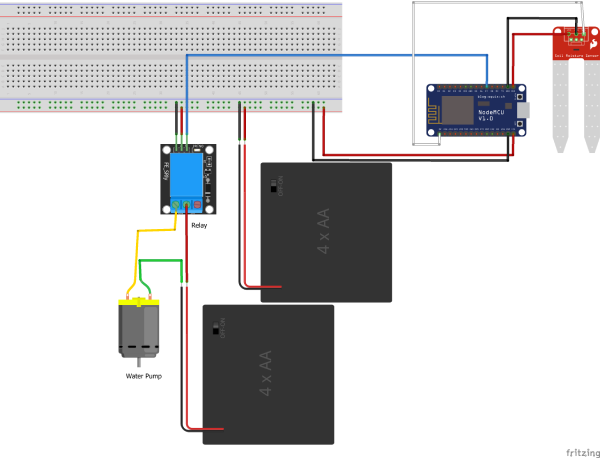

# SmartHome 

## Project Concept

## Project Architecture

## Sequence Diagrams

### Set Fan State

### Update State Node 1

### Update Last Watering Time

## Components 

- 1x Arduino Uno
- 1x Raspberry Pi Zero
- 1x ESP8266 WiFi Module
- 1x FTDI
- 1x NodeMCU Board ESP8266
- 1x MQ-2 Gas Sensor
- 1x Water Pump
- 1x Soil Moisture Sensor
- 2x Relay
- 1x DHT11 Sensor
- 1x Fan

## Schematics 

### Node 1

### Node 2

## APIs

- Firebase Realtime Database

- Firebase Cloud Messaging

- Dark Sky API

## Android App GUIs

## Author

* **Filipe Mesquita** - [filipemes](https://github.com/filipemes)

